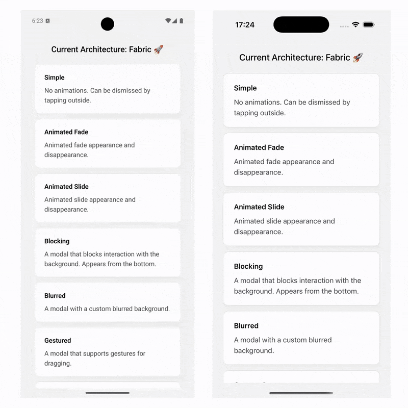

# React Native Multiple Modals

[](https://www.npmjs.com/package/react-native-multiple-modals)

[](https://www.npmjs.com/package/react-native-multiple-modals)

Native Modal implementation which allows to display multiple Modals simultaneously.



## ✨ Features

- 📱 iOS & Android
- 🚀 Performant Native Implementation
- ✅ Accessibility Support
- 💯 Compatible with Expo
- 💥 New Architecture (Fabric)
- 🆗 Old Architecture (Paper)
- 👌 Written in TypeScript

## Installation

```bash
npm i react-native-multiple-modals
```

or

```bash
yarn add react-native-multiple-modals
```

#### iOS

```bash
pod install --project-directory=ios
```

## Usage

```tsx
import { ModalView } from 'react-native-multiple-modals';

const YourComponent = () => {
  const [isVisible, setVisibility] = useState(false);

  return (
    <View>
      <Button text='Open modal' onPress={() => setVisibility(true)} />
      {isVisible && (
        <ModalView onRequestClose={() => setVisibility(false)}>
          <YourContentView />
        </ModalView>
      )}
    </View>
  );
};
```

More Examples: https://github.com/paufau/react-native-multiple-modals-examples

---

## Properties

### `contentContainerStyle?: ViewStyle`

Styles of the content wrapper. Use it for aligning your content view.

---

### `statusBarTranslucent?: boolean = false` - Android only

Determines whether your modal should go under the system statusbar.

---

### `onRequestClose?: (calledBy: 'Backdrop' | 'BackButton') => void`

The method is called when backdrop or back button is pressed

> _**TIP**_: If you want the modal to block the interface and not close when user taps the backdrop or back button. Then just don't pass this function. The modal will be rendered until you remove it from the React tree.

---

### `renderBackdrop?: () => ReactNode`

Use it to render custom backdrop. For example `<BlurView />`

---

### `backdropColor?: string`

Default: `rgba(0, 0, 0, 0.3)`

---

### `BackdropPressableComponent?: FC<PressableProps>`

The component which wraps `renderBackdrop`.
Use it to overwrite default props or make backdrop untouchable.

---

## Contribution

#### FOUND A BUG? HELP THE PROJECT AND REPORT IT!

If you notice any bugs or anything working differently compared to React Native, feel free to open an issue. It’ll really help improve the project 🙏.

Also, if there are any well-known issues in React Native that haven’t been fixed for a long time and they show up here too, let me know! Let’s make things better together 😎.

## Known issues

- Some layout animations from `react-native-reanimated` don't work properly inside the ModalView on new architecture

## Roadmap

Common:

- Add default `fade` and `slide` animations
- Add UI tests automation
- Create separate documentation page

## Versions

| version       | react-native | links                                                                               |
| ------------- | ------------ | ----------------------------------------------------------------------------------- |
| 2.0.0+        | 71+          | [Documentation](https://github.com/paufau/react-native-multiple-modals/tree/main)   |
| 1.0.0 - 1.2.6 | 70+          | [Documentation](https://github.com/paufau/react-native-multiple-modals/tree/v1.2.6) |

## Author

- [Pavel Pakseev](https://www.linkedin.com/in/pavel-pakseev/)

## Sponsor & Support

If you found the library useful, you can support me:

<a href='https://ko-fi.com/Y8Y315L7NK' target='_blank'></a>
