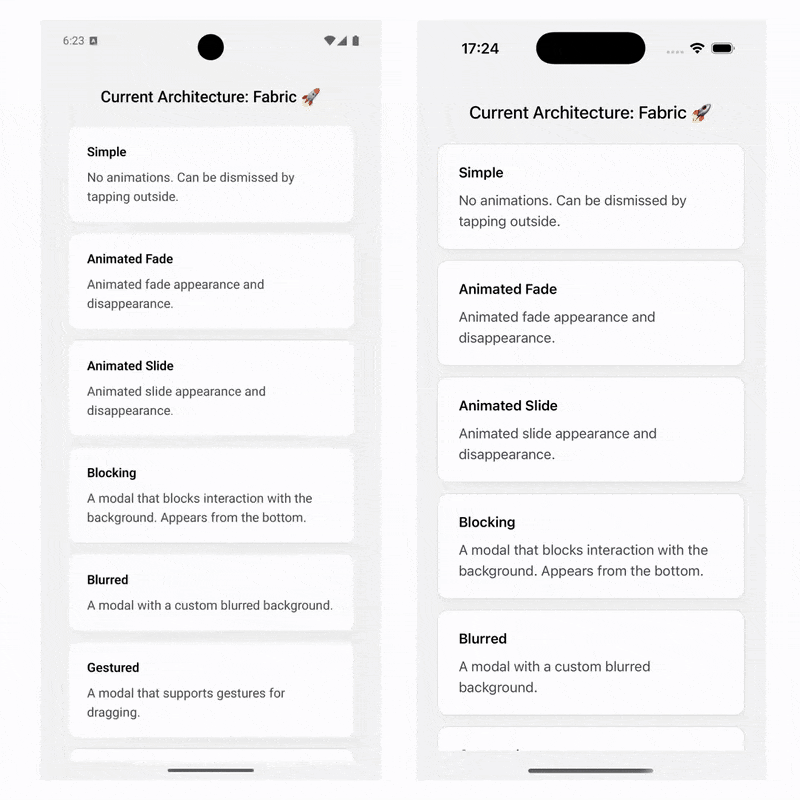

# React Native Multiple Modals

Native layering for React Native modals, sheets and overlays, including native Modal and bottom tabs.

## Features

- 🚀 Shows multiple instances at the same time
- 💯 Displays on top of default modal
- 🆗 Supports gesture handler out of the box
- 🛠️ Displays above bottom tabs navigation
- 📱 Adjusts content when rotated
- 💥 Enhanced status bar configuration
- ✅ Built with Accessibility support in mind (WCAG)

## Next steps

- [Getting Started](./getting-started.md)
- [Guides](/guides)
- [API Reference](./api.mdx)
